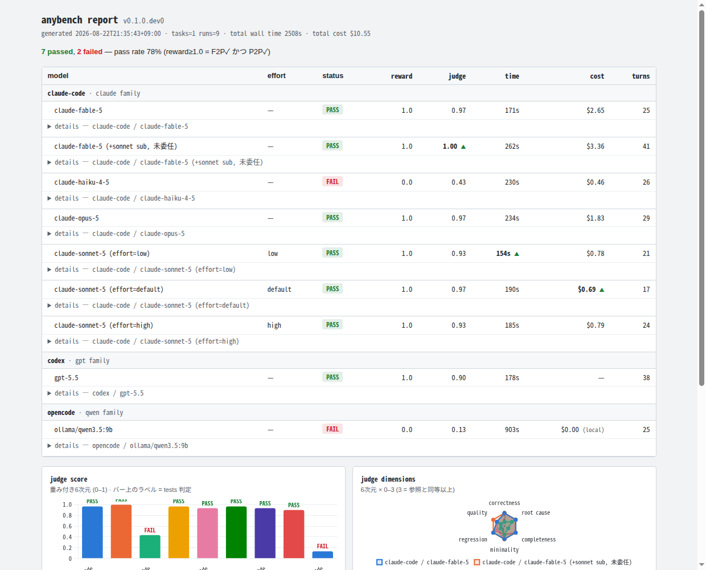

# anybench

**English** | [日本語](README.ja.md)

**Your own SWE-bench, harvested from your own dev sessions.**

anybench turns your real development work — the prompt you gave a coding agent, the fix you shipped, the environment it ran in — into private, replayable benchmark tasks. It then replays each task across multiple agent harnesses (Claude Code, Codex CLI, opencode, …) and models, and scores every candidate patch against your own human-verified fix.

> Status: early prototype (Phase 0 spike complete). One real task harvested and replayed across 3 harnesses × 3 model families × reasoning-effort levels. See [`PLAN.md`](PLAN.md) (Japanese) for the full research-backed design.



## Why

- **Zero contamination** — public benchmarks rot as models memorize gold patches (SWE-bench Verified was retired for exactly this). Tasks harvested from your private sessions are fresh by construction.
- **Real bug distribution** — synthetically injected bugs differ measurably from real ones (BugPilot). Your own fixes are, by definition, real.
- **The environment is captured alive** — automated environment reconstruction is the hardest part of task generation (31–50% success rates in the wild). Snapshotting the repo at the moment you fixed it sidesteps the problem entirely.

The concept was proven at organizational scale by Meta's REAP / ProdCodeBench (arXiv:2604.01527), but no personal, open-source implementation existed. anybench is that missing piece: *a harvesting front-end for standard task formats, plus hybrid evaluation and a local-first report.*

## How it works

```
[capture]              [harvest]               [replay]              [evaluate]           [view]
Claude Code hooks  →  session × git pairing → SWE-bench-style task → tests (F2P/P2P)   →  runs.jsonl
Codex rollouts        prompt extraction       purified workspace     + reference-guided    → static
opencode logs         gold verification       agents × models        LLM judge             HTML report
```

- **Task format**: SWE-bench schema (`base_commit`, gold `patch`, `test_patch`, `FAIL_TO_PASS` / `PASS_TO_PASS`) + a Harbor-style task directory (`instruction.md`, `environment/Dockerfile`, `solution/solve.sh`, `tests/test.sh` → reward file). No new formats invented.
- **Gold verification**: a task enters the bench only after P2P green @ base → F2P red @ test_patch → all green @ gold patch, repeated to exclude flakes, inside Docker (oracle reward 1.0 / no-op reward 0.0).
- **Replay**: each run gets a purified workspace (fresh single-commit repo, agent config files removed, scoped tool permissions). Harness version, model ID, sandbox mode and token/cost usage are recorded on every run.
- **Evaluation, layered**: deterministic tests first (tests always beat the judge — F2P fail forces correctness to 0), then a reference-guided 6-dimension rubric judge (0–3 anchored scales, position-swap ×2, min aggregation, judge model ≠ candidate model, judge/prompt versions stamped into every record).
- **Report**: `scripts/generate_report.py` reads `results/runs.jsonl` and emits a single-file HTML leaderboard grouped by *harness × model family × reasoning effort*, with Chart.js panels for judge score, per-dimension radar, wall time, and cost.

## What the spike found (1 task, 9 runs)

| harness | model | tests | judge | time | cost |
|---|---|---|---|---|---|
| claude-code | fable (+sonnet subagent) | ✅ | 1.00 | 262s | $3.36 |
| claude-code | sonnet (default effort) | ✅ | 0.97 | 190s | $0.69 |
| claude-code | opus / fable | ✅ | 0.97 | 171–234s | $1.83–2.65 |
| claude-code | sonnet (low / high effort) | ✅ | 0.93 | 154–185s | ~$0.78 |
| codex | gpt-5.5 | ✅ | 0.90 | 178s | (subscription) |
| claude-code | haiku 4.5 | ❌ P2P fail | 0.43 | 230s | $0.46 |
| opencode | qwen3.5:9b (local) | ❌ F2P fail | 0.13 | 903s | $0.00 |

Highlights: the harvested task discriminated cleanly (a mid-tier model passed the headline tests but broke a subtle sharing invariant that P2P caught; a local 9B model patched an unreachable code path); the judge's rationales matched test outcomes on all 9 candidates while surfacing real quality gaps (dead code, DRY violations, drift-prone predicate duplication) that tests alone missed.

## Harvest skill for Claude Code

`skills/anybench-harvest/` packages the harvesting procedure as a [Claude Code skill](https://code.claude.com/docs). Invoke it manually at the end of a coding session — right after you commit a fix — and it turns that commit into a verified anybench task:

```bash
# install globally (available in every repository)
./scripts/install-skill.sh --global

# or install into a single repository
./scripts/install-skill.sh /path/to/your/repo
```

Then, inside Claude Code:

```
/anybench-harvest            # harvest HEAD
/anybench-harvest <commit>   # harvest a specific commit
```

Session sources are supported across harnesses: the skill locates the originating session in **Claude Code** (`~/.claude/projects/` JSONL), **Codex** (`~/.codex/state_5.sqlite` threads index → rollout JSONL), **opencode** (`~/.local/share/opencode/opencode.db`), or **agy / Google Antigravity CLI** (`~/.gemini/antigravity-cli/conversation_summaries.db` → per-conversation SQLite) to recover the original prompt and stamp `origin_session`.

The skill splits the commit into gold/test patches, runs the full gold-verification protocol (P2P green @ base → F2P red @ test_patch → all green @ gold, ×3 for flakes), drafts a leak-free problem statement **for your approval**, packages the Harbor-style task directory under `$ANYBENCH_HOME/tasks/`, and validates it in Docker (no-op reward 0.0 / oracle reward 1.0). Tasks that fail verification are never registered. It also asks whether the original fix was human- or AI-authored, so self-consistency bias can be flagged later.

## Repository layout

```
PLAN.md               development plan (Japanese)
docs/research/        landscape research: benchmark OSS, LLM-as-judge, dashboards (Japanese)
judge/                reference-guided judge prompt + aggregation rules (v0.1)
skills/anybench-harvest/  Claude Code skill: harvest the latest fix commit into a task
scripts/
  install-skill.sh    install the harvest skill globally or into a repo
  record_run.py       append a run record (metrics + tests + judge) to results/runs.jsonl
  generate_report.py  render the static HTML leaderboard from runs.jsonl
tasks/    (local only, gitignored)  harvested tasks — contain snapshots of your private code
results/  (local only, gitignored)  run records, judgments, candidate diffs
report/   (local only, gitignored)  generated report
```

`tasks/`, `results/` and `report/` are **deliberately untracked**: they embed code, file paths and commit history from the private repositories you harvest. anybench is private-by-default; sharing task packs will be an explicit opt-in feature.

## Roadmap

Phase 1 turns the manual spike into commands: `anybench capture` (Claude Code hooks installer), `anybench harvest` (interactive task synthesis + gold verification), `anybench run` (Harbor-backed multi-harness replay), `anybench eval`, `anybench report`. See `PLAN.md` for the full phased plan, risks, and success metrics.

## References

The design borrows deliberately from prior art. Detailed notes live in [`docs/research/`](docs/research/) (Japanese).

**Papers**

- REAP / ProdCodeBench — harvesting benchmarks from real developer×agent sessions at org scale (Meta): [arXiv:2604.01527](https://arxiv.org/abs/2604.01527)
- SWE-bench — the canonical task schema and Docker evaluation harness: [arXiv:2310.06770](https://arxiv.org/abs/2310.06770) · [Why OpenAI retired SWE-bench Verified](https://openai.com/index/why-we-no-longer-evaluate-swe-bench-verified/) (contamination)
- BugPilot — synthetically injected bugs differ from real ones: [arXiv:2510.19898](https://arxiv.org/abs/2510.19898)
- SWT-Bench — generating reproduction tests validated against the gold patch: [arXiv:2406.12952](https://arxiv.org/abs/2406.12952)
- PatchDiff — "resolved" ≠ correct: 29.6% of plausible patches diverge behaviorally from ground truth (ICSE 2026): [arXiv:2503.15223](https://arxiv.org/abs/2503.15223)
- Agent-as-a-Judge — judges with repo-reading tools reach ~90% human agreement (ICML 2025): [OpenReview](https://openreview.net/forum?id=Nn9POI9Ekt)
- Agentic Rubrics — rubric checks catch real defects in test-passing patches: [arXiv:2601.04171](https://arxiv.org/abs/2601.04171)
- SWE Atlas — per-task rubrics drafted from issue + gold patch: [arXiv:2605.08366](https://arxiv.org/abs/2605.08366)
- CodeJudgeBench — pairwise > pointwise for code judging; position bias is real: [arXiv:2507.10535](https://arxiv.org/abs/2507.10535)
- A Survey on LLM-as-a-Judge — bias taxonomy and mitigations: [arXiv:2411.15594](https://arxiv.org/abs/2411.15594)
- Stop Comparing LLM Agents Without Disclosing the Harness — harness settings explain more variance than model choice: [arXiv:2605.23950](https://arxiv.org/abs/2605.23950)

**OSS & frameworks**

- [Harbor](https://github.com/harbor-framework/harbor) (terminal-bench successor) — task directory format, ~50 installed-agent adapters, ATIF trajectory format
- [Inspect AI](https://github.com/UKGovernmentBEIS/inspect_ai) — `sandbox_agent_bridge` model proxy, `eval_set` resume design, static log-viewer bundles
- [SWE-bench](https://github.com/SWE-bench/SWE-bench) / [SWE-rebench](https://huggingface.co/datasets/nebius/SWE-rebench) / [SWE-bench-Live](https://github.com/microsoft/SWE-bench-Live) — schema extensions (`install_config`, frozen requirements) and RepoLaunch environment capture
- [promptfoo](https://github.com/promptfoo/promptfoo) — matrix web viewer + SQLite storage pattern
- [HAL](https://hal.cs.princeton.edu/about) — cost-controlled leaderboards with Pareto frontiers
- [Hamel Husain, *Creating a LLM-as-a-Judge*](https://hamel.dev/blog/posts/llm-judge/) — critique-shadowing calibration against your own labels

## License

MIT
